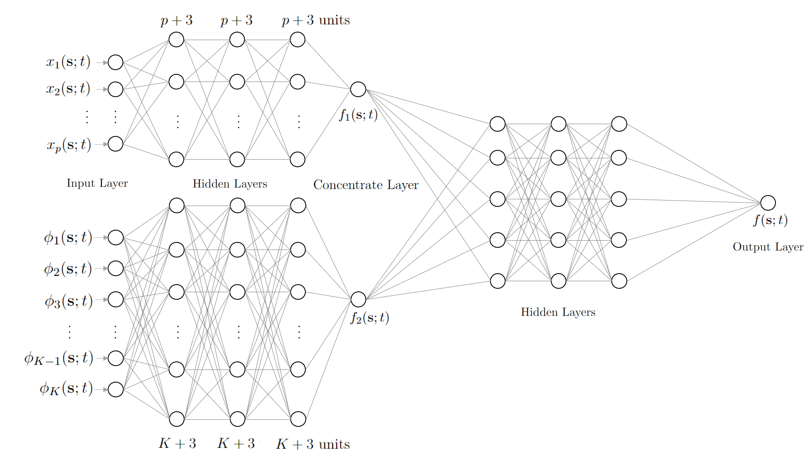
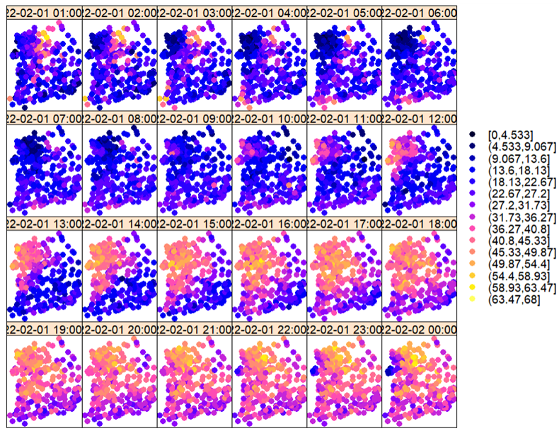

# Spatio-Temporal Prediction Using Deep Neural Networks
### 딥러닝을 활용한 시공간 데이터 예측

- 08 / 2023
- Park Tae Jun
- Seoul National University
- Department of Statistics
- Master's Thesis

## Abstract
Kriging provides the Best Linear Unbiased Predictor (BLUP) for a spatial data or spatio-temporal data. This is a method of interpolation used to predict spatial process or spatio-temporal process at unobserved locations. However, for complex data, Kriging, the linear predictor, may not be optimal. Nowadays, Deep learning using Deep neural networks (DNNs) is being used in many fields. Deep feedforward networks can be used for regression, so I propose a novel prediction method using DNN structure in this study. This method may learn more complex spatio-temporal dependencies. Next, I study the traditional Kriging and my method in terms of statistical learning theory. Finally, I apply my method to Korea fine dust data to evaluate the performance. Here, the K-fold Cross Validation method for spatio-temporal data is used.
- **Keywords**: Spatio-temporal data, Kriging, Deep learning, Deep Neural Networks, Deep feedforward networks, Statistical learning theory

## Visualization of DNN Structure

---

## Applicaition
We applied it to real-world data to compare the test performance of any of our models with the existing spatio-temporal kriging methods. For the data, Korea's fine dust spatio-temporal data was used. Fine dust data is known to be non-gaussian and difficult to predict. So, we try to evaluate the performance on complex models by using our method to show better performance of this data. 

### Data Description

As for the data, PM2.5 concentration data of land in Korea was obtained from AirKorea (https://www.airkorea.or.kr). Data from January 9, 2022, data from February 1, 2022, and data from June 29, 2022 were obtained from 1:00 to 24:00 (the next day 00:00) for a day with high, normal, and low  PM2.5 concentration. In this way, the performance of the model was evaluated for all cases by obtaining spatio-temporal data that included the time of three days of PM2.5 concentration and latitude longitude of the observatory. 

Data from January 9, 2022, when PM2.5 concentration is high, a total of 11544 data over 24 hours were used at a total of 481 stations, with an average value of PM2.5 concentration of approximately $67.419 \mu / m^3$. 
Next, data from February 1, 2022, when PM2.5 concentration is normal, a total of 10704 data over 24 hours were used at a total of 446 stations, with an average value of PM2.5 of approximately $29.008 \mu / m^3$.
Lastly, data from June 29, 2022, when PM2.5 concentration is low, a total of 10200 data over 24 hours were used at a total of 425 stations, with an average value of PM2.5 of approximately $5.153 \mu / m^3$.
For the observations, the histogram is shown in Figure 5.2. In addition, a summary of the observed data is shown in Table 5.1.

As the covariates, observations were used at the same time as the observed PM2.5 concentration. The source of the covariate data is the Korea Meteorological Administration (https://www.weather.go.kr). Six covariates were used: temperature, wind, wind x-axis components, wind y-axis components, precipitation, and humidity. However, since the location of the observation station where the PM2.5 concentration is observed and the observation station of the Korea Meteorological Administration is different, it is not completely consistent. So, we interpolated the covariate at the latitude and longitude of the observatory where we collected the PM2.5 concentration data. As a method, we used simple spatio-temporal kriging.

### Develop Environment

Since it needs GPUs to perform 25 tests, the test was conducted under 1xNVIDIA-TESLA-V100 GPU environment of Google Cloud Platform (GCP, https://cloud.google.com). In practical application situations, we applied the Dropout method (Srivastava et al., 2014) which can reduce overfitting, and the Batch Normalization method (Ioffe et al., 2015) which can stabilize the model. In addition, considering that spatio-temporal kriging can be done comfortably in the package of the R environment, the traditional spatio-temporal kriging method is compared using the same dataset in the R environment. 

---

## Main Reference

1. Wikle CK, Zammit-Mangion A, Cressie N. (2019). Spatio-temporal statistics with R. Chapman and Hall/CRC Press
2. Chen W, Li Y, Reich BJ, Sun Y. (2021). DeepKriging: Spatially dependent deep neural networks for spatial prediction. arXiv preprint arXiv:2007.11972

